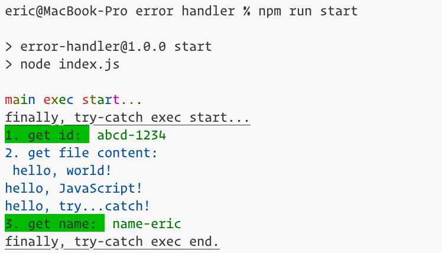
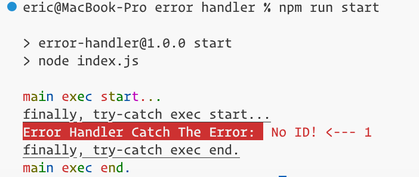
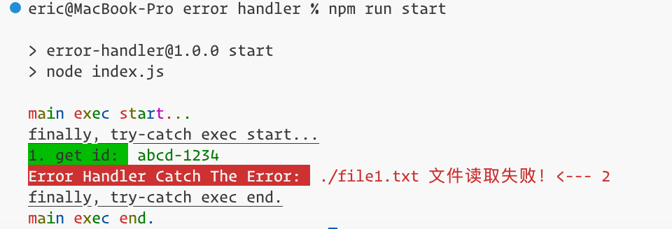
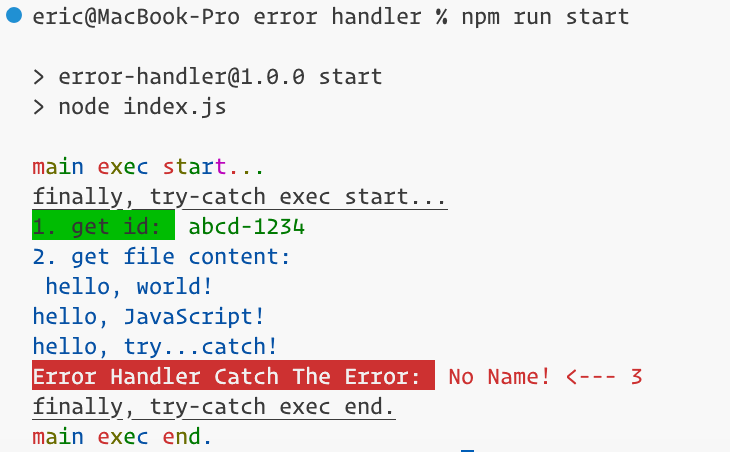

# error handler in js

**try...catch 语句用于捕获 JavaScript 异常，包括：**

- 同步代码中抛出的异常（使用 throw 关键字）
- 异步代码中**通过 Promise 对象**抛出的异常（使用 Promise.reject() 或返回一个被拒绝的 Promise 对象）
- 通过 throw 语句抛出的异常对象（例如 throw new Error('Something went wrong')）
- 通过 JavaScript 内置函数或 DOM API 抛出的异常（例如 JSON.parse() 解析无效 JSON 时抛出的异常）
- 通过自定义函数抛出的异常

**try...catch 语句捕获 JavaScript 异常的规则：**

> 如果 try 代码块中的第一个异步操作抛出异常，则 JavaScript 引擎会跳转到 catch 代码块中，并执行错误处理逻辑，此时第二个异步操作不会被执行。

示例代码：

```js
try {
  const result1 = await someAsyncOperation1(); // may throw error
  const result2 = await someAsyncOperation2(); // will not be executed if someAsyncOperation1() throws error
} catch (err) {
  console.error(err);
  // handle error
}
```

## install

```bash
npm i
```

## start

```bash
npm run start
# or
node index.js
```

You'll get three cases after executing my code.

- all passed
  
- the first one error
  
- the second one error
  
- the third one error
  

Thank you.
